# 🇹🇷 Türkiye Map VisionOS Application

This project is a VisionOS application that visualizes the boundaries of Turkey's 81 provinces in 3D.  
It serves as a strong example of **GeoJSON polygon data visualization** using **RealityKit**  
and showcases the power of **Spatial Computing** on VisionOS.


## ✨ Features

- **Visualization of 81 Provinces**: Renders the boundaries of all provinces in Turkey as colorful 3D polygons.
- **VisionOS Mixed Reality**: Optimized mixed reality experience for Apple Vision Pro.
- **GeoJSON Support**: Reads map data in standard GeoJSON format (81 provinces + islands).
- **MultiPolygon Support**: Special processing for islands and fragmented provinces.
- **Smart Filtering**: Optimizes performance by filtering out small islets.
- **81 Different Colors**: Each province is displayed in a unique HSB-generated color.
- **Head-Relative Positioning**: Map spawns directly in front of the user using ARKit head tracking.
- **Hand Manipulation**: Move, rotate, and scale the map with your hands.

## 🎮 Application Flow

```mermaid
flowchart TD
    A[🚀 Application Start] --> B[📱 ContentView]
    B --> C[🔘 Show Turkey Map Button]
    C --> D[🌍 ImmersiveMapView]
    D --> E[⚙️ setupContentEntity]
    E --> F[🗺️ makePolygon]
    F --> G[📂 loadGeoJSONData]
    G --> H[🔄 processFeatures]
    H --> I[🎨 81 Provinces Rendered]
    I --> J[🖐️ Hand Gestures Enabled]
```



## Project Structure

```
TR Spatial Atlas/
├── TRSpatialAtlas/
│   ├── App/
│   │   └── TR_Spatial_AtlasApp.swift      # Main application entry point
│   ├── Model/
│   │   ├── AppModel.swift                 # Application state management
│   │   ├── GeoJSONDataDTO.swift           # GeoJSON data models
│   │   └── GestureControlViewModel.swift  # Gesture handling (drag, scale, rotate)
│   ├── ViewModels/
│   │   └── TrSpatialAtlasViewModel.swift  # Main business logic & 3D rendering
│   ├── Views/
│   │   ├── ContentView.swift              # Main window UI
│   │   ├── ImmersiveMapView.swift         # 3D immersive space with ARKit
│   │   └── ToggleImmersiveSpaceButton.swift
│   ├── Turkey.geojson                     # 81 provinces map data (241KB)
│   └── Info.plist
├── Packages/
│   └── RealityKitContent/                 # RealityKit content package
└── scripts/
    └── validate_repo.sh                   # Git repo validation script
```

## 🎯 Project Story and Challenges

During the development of this project, **two serious rendering issues** were encountered and resolved:

### 🐛 Issue #1: "Confetti Effect" - Winding Order

**Symptoms**: The map was rendering, but it appeared as **small colorful fragments like confetti**.

#### Root Cause & Solution

- **Problem**: GeoJSON polygons were coming **clockwise**.
- RealityKit expects **counter-clockwise**.
- The polygons were facing **backwards** and were not visible!
- **Solution**: Added `vertices.reverse()` to all vertex arrays.
- **Result**: ✅ **ISSUE RESOLVED!** The entire map is displayed correctly!

### 🐛 Issue #2: Z-Fighting at Province Boundaries

**Symptoms**: Adjacent provinces were **flickering** at their shared boundaries.

#### Root Cause & Solution

- **Problem**: All provinces were rendered at the exact same Y height (`0.001`).
- The GPU couldn't decide which polygon was "in front" at shared edges.
- This caused oscillating visibility between overlapping triangles.
- **Solution**: Added a small Y offset per province based on its index:

```swift
// Each province gets a slightly different height
let yOffset: Float = 0.001 + Float(index) * 0.0001
```

- **Result**: ✅ **Z-fighting eliminated!** Smooth boundaries without flickering.

### 🎓 Lessons Learned

**1. Polygon Rendering Rule in RealityKit:**

```swift
// GeoJSON (Clockwise) → Not suitable for RealityKit!
let vertices = [point1, point2, point3, point4]

// SOLUTION: Reverse the vertex order
vertices.reverse()  // Counter-clockwise → Suitable for RealityKit! ✅
```

**2. Z-Fighting Prevention:**

```swift
// Give each overlapping surface a unique depth
let yOffset: Float = baseHeight + Float(index) * smallIncrement
```

## 🏗️ Technical Architecture

### **Main Components:**

- **VisionOS 26** - Apple Vision Pro operating system.
- **SwiftUI** - User interface.
- **RealityKit** - 3D graphics and polygon rendering.
- **ARKitSessionManager** - Handles AR session lifecycle and world/head tracking.
- **ARKit** - Head tracking for user-relative positioning.
- **GeoJSON** - Turkey map data (81 provinces + islands).
- **Mixed Reality** - Mixed reality experience.

## 🎨 Visual Features

### **Color Palette (81 Colors):**

Each province is assigned a unique color using HSB color generation:

```swift
let hue = CGFloat(i) / 81.0  // Full spectrum coverage
let saturation: CGFloat = 0.7 + (CGFloat(i % 3) * 0.1)
let brightness: CGFloat = 0.6 + (CGFloat(i % 4) * 0.1)
```

### **3D Features:**

- **Opacity**: 0.95 (high visibility)
- **MultiPolygon**: Islands and fragmented provinces are supported.
- **Smart Filtering**: Small islets are automatically filtered out.
- **Vertex Simplification**: Polygons with 255+ vertices are simplified.
- **Z-Fighting Prevention**: Each province at a unique Y height.

## 🖐️ Hand Gestures

Gesture control is managed by `GestureControlViewModel` using SwiftUI gestures:

| Gesture                | Action | Description                    |
| ---------------------- | ------ | ------------------------------ |
| 🖐️ **DragGesture**     | Move   | Drag the map in 3D space       |
| 🤏 **MagnifyGesture**  | Scale  | Pinch to zoom in/out           |
| 🔄 **RotateGesture3D** | Rotate | Rotate while scaling (15° min) |

```swift
// GestureControlViewModel handles all gestures
@State private var gestureVM = GestureControlViewModel()

RealityView { content in ... }
    .gesture(gestureVM.createTranslationGesture())
    .gesture(gestureVM.createScaleGesture())  // Includes RotateGesture3D
```

## 📍 Head-Relative Positioning

The map uses `ARKitSessionManager` (wrapping `WorldTrackingProvider`) to spawn in front of the user.
This ensures the map is always placed at a comfortable distance relative to the user's head position at launch.

```swift
// Validates head position and avoids race conditions during session start
let deviceAnchor = worldTracking.queryDeviceAnchor(atTimestamp: CACurrentMediaTime())
let headForward = SIMD3<Float>(-headTransform.columns.2.x, 0, -headTransform.columns.2.z)
let mapPosition = headPosition + normalize(headForward) * 2.5
```

**Fallback**: In simulator defaults to `(0, 1.2, -2.5)`.

## 🔧 Development Details

### **🔧 Configuration & Constants Explained**

The `Constants` struct in `TrSpatialAtlasViewModel.swift` is crucial for correct 3D positioning:

#### **1. `center` (35.0, 39.0) - Why is it needed?**

GeoJSON data uses real-world latitude/longitude (e.g., Istanbul: 29°E, 41°N). If we used these values directly in the 3D scene:

- The map would spawn far away from the scene origin `(0,0,0)` (e.g., 35 meters right, 39 meters forward).
- Rotating the map would be difficult because it would orbit around the origin (0,0,0) rather than spinning around its own center.

**Solution**: We define a `center` point (near Ankara) and subtract it from every coordinate (`longitude - center.x`). This shifts the map's center to the scene's origin `(0,0,0)`.

#### **2. `scaleFactor` (0.05) - Why is it needed?**

Geographic coordinate degrees do not map 1:1 to RealityKit's meter system.

- Without scaling, the map would be either massive or tiny.
- A factor of `0.05` scales the country down to a comfortable tabletop or room-scale size for the user.

#### **3. `mapDataFiles` - Why is it needed?**

This array defines which GeoJSON files to load. Currently, it contains only `["Turkey"]`, but it allows for easy extensibility. You can add new files like `["Turkey", "Istanbul_Detailed", "Lakes"]` without modifying the core logic.

```swift
// Code Implementation
let x = (longitude - center.x) * scaleFactor
let z = (latitude - center.y) * scaleFactor
let y: Float = yOffset  // Unique per province to prevent z-fighting
```

### **3D Mesh Creation:**

```swift
var meshDescriptor = MeshDescriptor()
meshDescriptor.positions = .init(vertices)
meshDescriptor.primitives = .polygons(counts, indices)

let mesh = try MeshResource.generate(from: [meshDescriptor])
var material = UnlitMaterial(color: provinceColor)
material.blending = .transparent(opacity: 0.95)

let entity = ModelEntity(mesh: mesh, materials: [material])
```

## 📊 Performance Optimizations

- ✅ **Single GeoJSON File**: 81 provinces in a single file (241KB)
- ✅ **Vertex Simplification**: 255+ vertices → automatic simplification
- ✅ **Island Filtering**: Small islands are automatically discarded
- ✅ **Efficient Batching**: Entity group per province
- ✅ **Z-Fighting Prevention**: Unique Y offset per province
- ✅ **Optimized Scale**: `scaleFactor = 0.05` (optimal size)

## 🚀 Upcoming Enhancements

1. **🎯 Interactivity**: Click on provinces to display information
2. **📊 Data Layers**: Population, income, tourism data overlay
3. **🎨 Animation**: Dynamic elevation of provinces

---

## 📚 Resources & Inspiration

- [WWDC Video](https://developer.apple.com/videos/play/wwdc2025/313/)
- [Data Viz: Creating a Data Visualization Dashboard](https://developer.apple.com/documentation/charts/creating-a-data-visualization-dashboard-with-swift-charts) - Interesting example project, specifically showing data points on a US map.

---

**Special Note:** The **Winding Order** and **Z-Fighting** issues encountered in this project are common problems in 3D graphics programming. These solutions can be applied to similar projects! 🎯
