# 🇹🇷 Türkiye Map VisionOS Application

This project is a VisionOS application that visualizes the boundaries of Turkey's 81 provinces in 3D.  
It serves as a strong example of **GeoJSON polygon data visualization** using **RealityKit**  
and showcases the power of **Spatial Computing** on VisionOS.


## ✨ Features

- **Visualization of 81 Provinces**: Renders the boundaries of all provinces in Turkey as colorful 3D polygons.
- **VisionOS Mixed Reality**: Optimized mixed reality experience for Apple Vision Pro.
- **GeoJSON Support**: Reads map data in standard GeoJSON format (81 provinces + islands).
- **MultiPolygon Support**: Special processing for islands and fragmented provinces.
- **Smart Filtering**: Optimizes performance by filtering out small islets.
- **81 Different Colors**: Each province is displayed in a unique HSB-generated color.
- **Head-Relative Positioning**: Map spawns directly in front of the user using ARKit head tracking.
- **Hand Manipulation**: Move, rotate, and scale the map with your hands.
- **Map Mode Toggle**: Switch between flat (tabletop) and vertical (wall) modes with animated transitions.
- **Dynamic Control Panel**: Control panel repositions automatically based on map orientation.

## 🎮 Application Flow

```mermaid
flowchart TD
    A[🚀 Application Start] --> B[📱 ContentView]
    B --> C[🔘 Show Turkey Map Button]
    C --> D[🌍 ImmersiveMapView]
    D --> E[⚙️ setupContentEntity]
    E --> F[🗺️ makePolygon]
    F --> G[📂 loadGeoJSONData]
    G --> H[🔄 processFeatures]
    H --> I[🎨 81 Provinces Rendered]
    I --> J[🖐️ Hand Gestures Enabled]
```



## Project Structure

```
TR Spatial Atlas/
├── TRSpatialAtlas/
│   ├── App/
│   │   └── TR_Spatial_AtlasApp.swift      # Main application entry point
│   ├── Model/
│   │   ├── AppModel.swift                 # Application state management
│   │   ├── GeoJSONDataDTO.swift           # GeoJSON data models
│   │   └── GestureControlViewModel.swift  # Gesture handling (drag, scale, rotate)
│   ├── ViewModels/
│   │   └── TrSpatialAtlasViewModel.swift  # Core Logic: Data Handling, Dispatcher, 3D Builders, Helpers
│   ├── Utilities/
│   │   └── Logger+Extension.swift         # Centralized OSLog system (MapData, ContentGeneration, Performance)
│   ├── Views/
│   │   ├── ContentView.swift              # Main window UI
│   │   ├── ImmersiveMapView.swift         # 3D immersive space with ARKit
│   │   ├── MapDetails.swift               # Map mode control panel (flat/vertical toggle)
│   │   └── ToggleImmersiveSpaceButton.swift
│   ├── Turkey.geojson                     # 81 provinces map data (241KB)
│   └── Info.plist
├── Packages/
│   └── RealityKitContent/                 # RealityKit content package
└── scripts/
    └── validate_repo.sh                   # Git repo validation script
```

## 🎯 Project Story and Challenges

During the development of this project, **two serious rendering issues** were encountered and resolved:

### 🐛 Issue #1: "Confetti Effect" - Winding Order & Backface Culling

**Symptoms**: The map was rendering, but it appeared as **small colorful fragments like confetti**. Additionally, when rotating between flat and vertical modes, some polygons would disappear.

#### Root Cause & Solution

**Part A - Winding Order:**

- **Problem**: GeoJSON polygons were coming **clockwise**.
- RealityKit expects **counter-clockwise**.
- The polygons were facing **backwards** and were not visible!
- **Solution**: Added `vertices.reverse()` to all vertex arrays.

**Part B - Backface Culling (Map Rotation):**

- **Problem**: When rotating the map from flat to vertical mode, some province polygons would disappear.
- RealityKit performs **backface culling** by default - only front faces are visible.
- When the map rotates, some polygon normals face away from the camera.
- **Solution**: Set `faceCulling = .none` on all materials to make polygons **double-sided**:

```swift
var material = UnlitMaterial(color: color)
material.blending = .transparent(opacity: 0.95)
material.faceCulling = .none  // Double-sided for rotation
```

- **Result**: ✅ **ISSUE RESOLVED!** The entire map displays correctly in both flat and vertical modes!

### 🐛 Issue #2: Z-Fighting at Province Boundaries

**Symptoms**: Adjacent provinces were **flickering** at their shared boundaries.

#### Root Cause & Solution

- **Problem**: All provinces were rendered at the exact same Y height (`0.001`).
- The GPU couldn't decide which polygon was "in front" at shared edges.
- This caused oscillating visibility between overlapping triangles.
- **Solution**: Added a small Y offset per province based on its index:

```swift
// Each province gets a slightly different height
let yOffset: Float = 0.001 + Float(index) * 0.0001
```

- **Result**: ✅ **Z-fighting eliminated!** Smooth boundaries without flickering.

### 🎓 Lessons Learned

**1. Polygon Rendering Rule in RealityKit:**

```swift
// GeoJSON (Clockwise) → Not suitable for RealityKit!
let vertices = [point1, point2, point3, point4]

// SOLUTION: Reverse the vertex order
vertices.reverse()  // Counter-clockwise → Suitable for RealityKit! ✅
```

**2. Z-Fighting Prevention:**

```swift
// Give each overlapping surface a unique depth
let yOffset: Float = baseHeight + Float(index) * smallIncrement
```

**3. Vertex Limit & Downsampling:**

VisionOS and RealityKit have vertex limits for a single mesh. We implemented a smart downsampling algorithm:

```swift
// If a polygon has > 255 vertices, reduce detail intelligently
// Takes 1 out of every 'step' points to prevent crashes and FPS drops
let step = Int(ceil(Double(vertices.count) / Double(targetVertexCount)))
```

**4. North-South Orientation (Coordinate System):**

When the map is laid flat (parallel to ground), the Z-axis determines the north-south orientation. Negating the Z coordinate ensures correct geographic orientation:

```swift
// Without negation: South appears at the top (incorrect)
// With negation: North is further from user, South is closer (correct)
let z = -(latitude - constants.center.y) * constants.scaleFactor
```

**5. Rotation Angle Adjustment:**

When the Z coordinate is negated, the rotation angle must also be adjusted to maintain the correct facing direction:

```swift
// Before Z negation: -.pi/2 (map faced away from user)
// After Z negation: +.pi/2 (map faces toward user)
let xRotation = simd_quatf(angle: .pi / 2, axis: SIMD3<Float>(1, 0, 0))
```

## 🏗️ Technical Architecture

### **Main Components:**

- **VisionOS 26** - Apple Vision Pro operating system.
- **SwiftUI** - User interface.
- **RealityKit** - 3D graphics and polygon rendering.
- **ARKitSessionManager** - Handles AR session lifecycle and world/head tracking.
- **ARKit** - Head tracking for user-relative positioning.
- **GeoJSON** - Turkey map data (81 provinces + islands).
- **OSLog** - Centralized, categorized, and performance-oriented logging system.
- **Mixed Reality** - Mixed reality experience.

### **Core Logic Breakdown (ViewModel):**

The `TrSpatialAtlasViewModel` is organized into distinct responsibilities:

1.  **Setup**: Prepares the RealityKit scene (Rotation, Gestures).
2.  **Data Handling**: Loads and parses `Turkey.geojson`.
3.  **Dispatcher**: `processFeatures` acts as a traffic controller, routing raw data to specific builders.
4.  **Geometry Builders**: Specialized functions for `Point`, `LineString`, `Polygon`, and `MultiPolygon`.
5.  **Helpers**: Critical performance tools like `createSubdividedPolygon`.

### **Logging System:**

We replaced standard `print()` statements with a centralized `Logger` extension (`Utilities/Logger+Extension.swift`) for better debugging and filtering in Console.app:

- `Logger.mapData`: JSON parsing and file IO.
- `Logger.contentGeneration`: Mesh creation and entity management.
- `Logger.performance`: Benchmarking and optimization alerts.
- `Logger.ui`: User interface events.

## 🎨 Visual Features

### **Color Palette (81 Colors):**

Each province is assigned a unique color using HSB color generation:

```swift
let hue = CGFloat(i) / 81.0  // Full spectrum coverage
let saturation: CGFloat = 0.7 + (CGFloat(i % 3) * 0.1)
let brightness: CGFloat = 0.6 + (CGFloat(i % 4) * 0.1)
```

### **3D Features:**

- **Opacity**: 0.95 (high visibility)
- **MultiPolygon**: Islands and fragmented provinces are supported.
- **Smart Filtering**: Small islets are automatically filtered out.
- **Vertex Simplification**: Polygons with 255+ vertices are simplified.
- **Z-Fighting Prevention**: Each province at a unique Y height.

## 🖐️ Hand Gestures

Gesture control is managed by `GestureControlViewModel` using SwiftUI gestures:

| Gesture                | Action | Description                    |
| ---------------------- | ------ | ------------------------------ |
| 🖐️ **DragGesture**     | Move   | Drag the map in 3D space       |
| 🤏 **MagnifyGesture**  | Scale  | Pinch to zoom in/out           |
| 🔄 **RotateGesture3D** | Rotate | Rotate while scaling (15° min) |

```swift
// GestureControlViewModel handles all gestures
@State private var gestureVM = GestureControlViewModel()

RealityView { content in ... }
    .gesture(gestureVM.createTranslationGesture())
    .gesture(gestureVM.createScaleGesture())  // Includes RotateGesture3D
```

## �️ Map Mode Toggle

The map supports two viewing modes with smooth animated transitions:

| Mode                   | Description                                 | Control Panel Position |
| ---------------------- | ------------------------------------------- | ---------------------- |
| 🪑 **Flat (Tabletop)** | Map lies horizontal, parallel to the ground | Below the map (Y=0.5)  |
| 🧱 **Vertical (Wall)** | Map stands upright like a wall display      | Above the map (Y=2.0)  |

### Implementation Details:

```swift
// MapDetails.swift - Toggle button UI
MapDetails(turnOnMapFlat: {
    viewModel.rotateMap(flat: true)
    viewModel.moveControlPanel(toTop: false)  // Panel moves down
}, turnOffMapFlat: {
    viewModel.rotateMap(flat: false)
    viewModel.moveControlPanel(toTop: true)   // Panel moves up
})

// TrSpatialAtlasViewModel.swift - Animated rotation
func rotateMap(flat: Bool) {
    var targetTransform = contentEntity.transform
    if flat {
        targetTransform.rotation = simd_quatf(angle: .pi / 2, axis: SIMD3<Float>(1, 0, 0))
    } else {
        targetTransform.rotation = simd_quatf(angle: 0, axis: SIMD3<Float>(1, 0, 0))
        targetTransform.translation.y -= 1.5  // Move map down in vertical mode
    }
    contentEntity.move(to: targetTransform, relativeTo: contentEntity.parent, duration: 0.5)
}
```

### Key Features:

- **Animated Transitions**: 0.5 second smooth animations using `Entity.move(to:)`
- **Dynamic Control Panel**: Panel repositions to stay accessible in both modes
- **Double-Sided Rendering**: `faceCulling = .none` ensures polygons are visible from both sides during rotation
- **Billboard Effect**: Control panel uses `BillboardComponent()` to always face the user regardless of their position

```swift
// ImmersiveMapView.swift - Control panel always faces user
sceneAttachment.components.set(BillboardComponent())
```

## �📍 Head-Relative Positioning

The map uses `ARKitSessionManager` (wrapping `WorldTrackingProvider`) to spawn in front of the user.
This ensures the map is always placed at a comfortable distance relative to the user's head position at launch.

```swift
// Validates head position and avoids race conditions during session start
let deviceAnchor = worldTracking.queryDeviceAnchor(atTimestamp: CACurrentMediaTime())
let headForward = SIMD3<Float>(-headTransform.columns.2.x, 0, -headTransform.columns.2.z)
let mapPosition = headPosition + normalize(headForward) * 2.5
```

**Fallback**: In simulator defaults to `(0, 1.2, -2.5)`.

## 🔧 Development Details

### **🔧 Configuration & Constants Explained**

The `Constants` struct in `TrSpatialAtlasViewModel.swift` is crucial for correct 3D positioning:

#### **1. `center` (35.0, 39.0) - Why is it needed?**

GeoJSON data uses real-world latitude/longitude (e.g., Istanbul: 29°E, 41°N). If we used these values directly in the 3D scene:

- The map would spawn far away from the scene origin `(0,0,0)` (e.g., 35 meters right, 39 meters forward).
- Rotating the map would be difficult because it would orbit around the origin (0,0,0) rather than spinning around its own center.

**Solution**: We define a `center` point (near Ankara) and subtract it from every coordinate (`longitude - center.x`). This shifts the map's center to the scene's origin `(0,0,0)`.

#### **2. `scaleFactor` (0.05) - Why is it needed?**

Geographic coordinate degrees do not map 1:1 to RealityKit's meter system.

- Without scaling, the map would be either massive or tiny.
- A factor of `0.05` scales the country down to a comfortable tabletop or room-scale size for the user.

#### **3. `mapDataFiles` - Why is it needed?**

This array defines which GeoJSON files to load. Currently, it contains only `["Turkey"]`, but it allows for easy extensibility. You can add new files like `["Turkey", "Istanbul_Detailed", "Lakes"]` without modifying the core logic.

```swift
// Code Implementation
let x = (longitude - center.x) * scaleFactor
let z = (latitude - center.y) * scaleFactor
let y: Float = yOffset  // Unique per province to prevent z-fighting
```

### **3D Mesh Creation:**

```swift
var meshDescriptor = MeshDescriptor()
meshDescriptor.positions = .init(vertices)
meshDescriptor.primitives = .polygons(counts, indices)

let mesh = try MeshResource.generate(from: [meshDescriptor])
var material = UnlitMaterial(color: provinceColor)
material.blending = .transparent(opacity: 0.95)

let entity = ModelEntity(mesh: mesh, materials: [material])
```

## 📊 Performance Optimizations

- ✅ **Single GeoJSON File**: 81 provinces in a single file (241KB)
- ✅ **Vertex Limit Management**: Critical for preventing crashes. Uses **Downsampling** to reduce vertex count while preserving shape.
- ✅ **Island Filtering**: Small islands are automatically discarded
- ✅ **Efficient Batching**: Entity group per province
- ✅ **Z-Fighting Prevention**: Unique Y offset per province
- ✅ **Optimized Scale**: `scaleFactor = 0.05` (optimal size)
- ✅ **Structured Logging**: Zero-overhead logging with `OSLog` in Release builds.

## 🚀 Upcoming Enhancements

1. **🎯 Interactivity**: Click on provinces to display information
2. **📊 Data Layers**: Population, income, tourism data overlay
3. **🎨 Animation**: Dynamic elevation of provinces

---

## 📚 Resources & Inspiration

- [WWDC Video](https://developer.apple.com/videos/play/wwdc2025/313/)
- [Data Viz: Creating a Data Visualization Dashboard](https://developer.apple.com/documentation/charts/creating-a-data-visualization-dashboard-with-swift-charts) - Interesting example project, specifically showing data points on a US map.

---

**Special Note:** The **Winding Order** and **Z-Fighting** issues encountered in this project are common problems in 3D graphics programming. These solutions can be applied to similar projects! 🎯


---

## 📄 License

This project is licensed under the BSD-3-Clause License - see the [LICENSE.txt](LICENSE.txt) file for details.

---

<div align="center">

**Made with ❤️ for Apple Vision Pro**

_Created by Durul Dalkanat © 2025_

</div>
